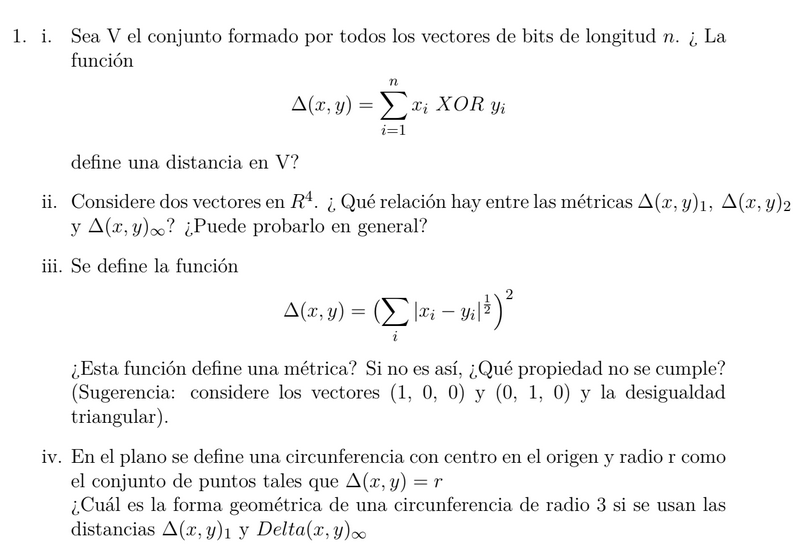
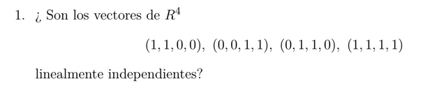
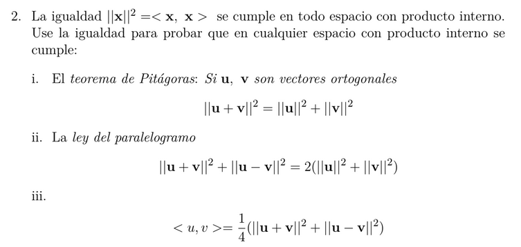
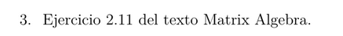
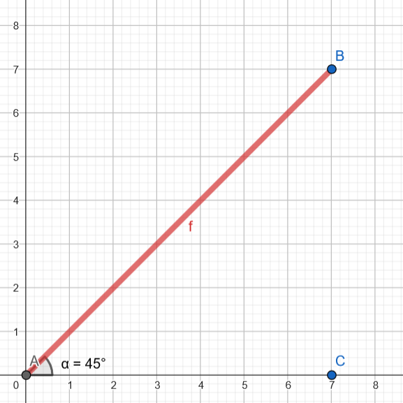

# Taller #1 - Matematicas para la computación I

### Maestría en ingeniería de sistemas y computación

#### Universidad Tecnologica de Pereira

---

i) Para verificar que la función define la distacia V, esta debería cumplir las siguientes propiedades:

$$
\triangle(x, y) > 0 \Leftrightarrow x \neq y
$$

$$
\triangle(x, y) = 0 \Leftrightarrow x = y
$$

$$
\triangle(x, y) = \triangle(y, x)
$$

$$
\triangle(x, y) \le \triangle(x, z) + \triangle(z, y)
$$

Ya que se indica que los vectores son de 4 bits consideremos los siguientes ejemplos para demostrar lo que indica el enunciado:

$$
x = (0, 0, 0, 1) \Rightarrow 1
$$

$$
y = (0, 0, 1, 1) \Rightarrow 3
$$

Ahora si vemos los vectores con la función XOR tenemos:

$$
0 \space XOR \space 0 \space \rightarrow 0 \newline
0 \space XOR \space 0 \space \rightarrow 0 \newline
0 \space XOR \space 1 \space \rightarrow 1 \newline
1 \space XOR \space 1 \space \rightarrow 0
$$

$$
x \space XOR \space y \space = 2
$$

Por tanto se cumple:

$$
\triangle(x, y) > 0 \Leftrightarrow x \neq y \space \checkmark
$$

Ahora bien para mostrar la segundo propiedad, usaremos:

$$
x = (1, 0, 0, 1) \Rightarrow 1
$$

$$
y = (1, 0, 0, 1) \Rightarrow 3
$$

Ahora si vemos los vectores con la función XOR tenemos:

$$
1 \space XOR \space 1 \space \rightarrow 0 \newline
0 \space XOR \space 0 \space \rightarrow 0 \newline
0 \space XOR \space 0 \space \rightarrow 0 \newline
1 \space XOR \space 1 \space \rightarrow 0
$$

Por tanto se cumple la segundo propiedad:

$$
\triangle(x, y) = 0 \Leftrightarrow x = y \space \checkmark
$$

Para mostrar la tercera de las propiedades:

$$
\triangle(x, y) = \triangle(y, x)
$$

Es pueden usar los mismos vectores de antes:

$$
x = (0, 0, 0, 1) \Rightarrow 1
$$

$$
y = (0, 0, 1, 1) \Rightarrow 3
$$

De modo que la expresión de $\triangle(x, y)$ sería:

$$
0 \space XOR \space 0 \space \rightarrow 0 \newline
0 \space XOR \space 0 \space \rightarrow 0 \newline
0 \space XOR \space 1 \space \rightarrow 1 \newline
1 \space XOR \space 1 \space \rightarrow 0
$$

$$
x \space XOR \space y \space = 2
$$

Mientras que la expresión de $\triangle(y, x)$ sería:

$$
0 \space XOR \space 0 \space \rightarrow 0 \newline
0 \space XOR \space 0 \space \rightarrow 0 \newline
1 \space XOR \space 1 \space \rightarrow 1 \newline
1 \space XOR \space 0 \space \rightarrow 0
$$

$$
y \space XOR \space x \space = 2
$$

Por lo que se afirma que:

$$
\triangle(x, y) = \triangle(y, x) \checkmark
$$

Para la cuarta y última propiedad, se ha cumplir que:

$$
\triangle(x, y) \le \triangle(x, z) + \triangle(z, y)
$$

Por tanto se necesita de un vector Z que será:

$$
x = (0, 0, 0, 1) \Rightarrow 1
$$

$$
y = (0, 0, 1, 1) \Rightarrow 3
$$

$$
z = (0, 1, 0, 0) \Rightarrow 4
$$

De modo que al efectuar la expresión $\triangle(x, y) \le \triangle(x, z) + \triangle(z, y)$ y para simplificar el calculo tenemos que:

$\triangle(x, y)$

$$
0 \space XOR \space 0 \space \rightarrow 0 \newline
0 \space XOR \space 0 \space \rightarrow 0 \newline
0 \space XOR \space 1 \space \rightarrow 1 \newline
1 \space XOR \space 1 \space \rightarrow 0
$$

$$
x \space XOR \space y \space = 2
$$

$\triangle(x, z)$

$$
0 \space XOR \space 0 \space \rightarrow 0 \newline
0 \space XOR \space 1 \space \rightarrow 1 \newline
0 \space XOR \space 0 \space \rightarrow 0 \newline
1 \space XOR \space 0 \space \rightarrow 1
$$

$$
x \space XOR \space y \space = 5
$$

$\triangle(y, z)$

$$
0 \space XOR \space 0 \space \rightarrow 0 \newline
0 \space XOR \space 1 \space \rightarrow 1 \newline
1 \space XOR \space 0 \space \rightarrow 1 \newline
1 \space XOR \space 0 \space \rightarrow 1
$$

$$
x \space XOR \space y \space = 7
$$

Por lo que reemplanzando en $\triangle(x, y) \le \triangle(x, z) + \triangle(z, y)$ tenemos:

$$
\triangle(x, y) = 2 \newline
\triangle(x, z) = 5 \newline
\triangle(z, y) = 7
$$

$$
2 \le 5 + 7
$$

$$
\therefore 2 \le 12
$$

Por lo anterior se afirma que:

$$
\triangle(x, y) \le \triangle(x, z) + \triangle(z, y) \checkmark
$$

Por tanto, se puede afirmar que la función mencionada anteriormente define una distación en el conjunto $V$

ii) Consideremos 2 vectores, cada uno para $\triangle(x, y)_{1}$ y otro para $\triangle(x, y)_{2}$

$$
\triangle(x, y)_{1} = (1, 6, 3, 0)
$$

$$
\triangle(x, y)_{2} = (3, 1, 0, 9)
$$

Y el vector $\triangle(x, y)_{\infty}$ que será generico.

La hipotesis será que las distancias Manhattan, Euclidiana y la distacia maxima entre los vectores deberá de presentar algún tipo de cambio

$$
\sum_{i=1}^{h}{\mid x_{i} - y_{i} \mid} \neq \sqrt{\sum_{i=1}^{e}{(x_i - y_i)^{2}}} \neq Max(\mid x_{1} - y_{1} \mid, \mid x_{2} - y_{2} \mid, ..., \mid x_{n} - y_{n} \mid)
$$

Para determinar si la hipotesis es correcta se puede usar los vectores $x$ y $y$

### Distancia Manhattan

$$
\sum_{i=1}^{h}{\mid x_{i} - y_{i} \mid} = \space \mid 1 - 3 \mid + \mid 6 - 1 \mid + \mid 3 - 0 \mid + \mid 0 - 9 \mid
$$

$$
\sum_{i=1}^{h}{\mid x_{i} - y_{i} \mid} = \space \mid - 2 \mid + \mid 5 \mid + \mid 3 \mid + \mid - 9 \mid
$$

$$
\sum_{i=1}^{h}{\mid x_{i} - y_{i} \mid} = \space \mid - 2 \mid + \mid 5 \mid + \mid 3 \mid + \mid - 9 \mid
$$

$$
\sum_{i=1}^{h}{\mid x_{i} - y_{i} \mid} = 19
$$

### Distancia Euclidiana

$$
\sqrt{\sum_{i=1}^{e}{(x_i - y_i)^{2}}} = \space \sqrt{(1 - 3)^2 + (6 - 1)^2 + (3 - 0)^2 + (0 - 9)^2}
$$

$$
\sqrt{\sum_{i=1}^{e}{(x_i - y_i)^{2}}} = \space \sqrt{(- 2)^2 + (5)^2 + (3)^2 + (- 9)^2}
$$

$$
\sqrt{\sum_{i=1}^{e}{(x_i - y_i)^{2}}} = \space \sqrt{4 + 25 + 9 + 81}
$$

$$
\sqrt{\sum_{i=1}^{e}{(x_i - y_i)^{2}}} = \space \sqrt{119}
$$

$$
\sqrt{\sum_{i=1}^{e}{(x_i - y_i)^{2}}} = \space 10.91
$$

### Maxima distancia

$$
Max(\mid x_{1} - y_{1} \mid, \mid x_{2} - y_{2} \mid, ..., \mid x_{n} - y_{n} \mid) = Max(\mid 1 - 3 \mid, \mid 6 - 1 \mid, \mid 3 - 0 \mid, \mid 0 - 9 \mid)
$$

$$
Max(\mid x_{1} - y_{1} \mid, \mid x_{2} - y_{2} \mid, ..., \mid x_{n} - y_{n} \mid) = Max(\mid - 2 \mid, \mid 5 \mid, \mid 3 \mid, \mid - 9 \mid)
$$

$$
Max(\mid x_{1} - y_{1} \mid, \mid x_{2} - y_{2} \mid, ..., \mid x_{n} - y_{n} \mid) = 5
$$

Por tanto se puede afirmar que se cumple la hipotesis, efectivamente existe diferencia, especificamente se puede decir que existe una disminusión significativa entre las distacias según el método:

$$
\sum_{i=1}^{h}{\mid x_{i} - y_{i} \mid} \ge \sqrt{\sum_{i=1}^{e}{(x_i - y_i)^{2}}} \ge Max(\mid x_{1} - y_{1} \mid, \mid x_{2} - y_{2} \mid, ..., \mid x_{n} - y_{n} \mid)
$$

$$
\therefore 19 \ge 10.91 \ge 5
$$

iii) Para poder determinar las propiedades que cumple y las que no, se han de determinar nuevamente las propiedades del punto (i), por tanto debe de cumplir:

$$
\triangle(x, y) > 0 \Leftrightarrow x \neq y
$$

$$
\triangle(x, y) = 0 \Leftrightarrow x = y
$$

$$
\triangle(x, y) = \triangle(y, x)
$$

$$
\triangle(x, y) \le \triangle(x, z) + \triangle(z, y)
$$

Para poder verificar que propiedades cumple, se han de determinar algunos vectores para probar, para ello usaremos:

$$
x = (1, 0, 0)
$$

$$
y = (0, 1, 0)
$$

Para determinar si la primera de las propiedades cumple podemos expresar el calculo de la siguiente manera:

$$
\triangle(x, y) > 0 \Leftrightarrow x \neq y
$$

$$
\triangle(x, y) = (\sqrt{\mid 1 - 0 \mid} + \sqrt{\mid 0 - 1 \mid} + \sqrt{\mid 0 - 0 \mid})^{2}
$$

$$
\triangle(x, y) = (\sqrt{\mid 1 \mid} + \sqrt{\mid - 1 \mid} + 0)^{2}
$$

$$
\triangle(x, y) = (\sqrt{ 1 } + \sqrt{ 1 })^{2}
$$

$$
\triangle(x, y) = ( 1 + 1 )^{2}
$$

$$
\triangle(x, y) = ( 1 + 1 )^{2}
$$

$$
\triangle(x, y) = ( 2 )^{2}
$$

$$
\triangle(x, y) = 4
$$

$$
\therefore \triangle(x, y) > 0 \Leftrightarrow x \neq y \space \checkmark
$$

Para comprobar la segunda de las propiedades podemos hacer un proceso muy similar, por lo que se dice que:

$$
\triangle(x, y) = 0 \Leftrightarrow x = y
$$

$$
\triangle(x, x) = (\sqrt{\mid 1 - 1 \mid} + \sqrt{\mid 0 - 0 \mid} + \sqrt{\mid 0 - 0 \mid})^{2}
$$

$$
\triangle(x, x) = (0 + 0 + 0)^{2}
$$

$$
\triangle(x, x) = (0)^{2}
$$

$$
\triangle(x, x) = 0
$$

$$
\therefore \triangle(x, y) = 0 \Leftrightarrow x = y \space \checkmark
$$

Para verificar la tercer propiedad podemos usar una aproximación muy similar y los mismos vectores $x$ & $y$, por tanto se puede determinar que:

$$
\triangle(x, y) = \triangle(y, x)
$$

Primero se determinar $\triangle(x, y)$

$$
\triangle(x, y) = (\sqrt{\mid 1 - 0 \mid} + \sqrt{\mid 0 - 1 \mid} + \sqrt{\mid 0 - 0 \mid})^{2}
$$

$$
\triangle(x, y) = (\sqrt{\mid 1 \mid} + \sqrt{\mid - 1 \mid} + 0)^{2}
$$

$$
\triangle(x, y) = (\sqrt{ 1 } + \sqrt{ 1 })^{2}
$$

$$
\triangle(x, y) = ( 1 + 1 )^{2}
$$

$$
\triangle(x, y) = ( 1 + 1 )^{2}
$$

$$
\triangle(x, y) = ( 2 )^{2}
$$

$$
\triangle(x, y) = 4
$$

Luego podemos determinar $\triangle(y, x)$:

$$
\triangle(y, x) = (\sqrt{\mid 0 - 1 \mid} + \sqrt{\mid 1 - 0 \mid} + \sqrt{\mid 0 - 0 \mid})^{2}
$$

$$
\triangle(y, x) = (\sqrt{\mid - 1 \mid} + \sqrt{\mid 1 \mid} + 0)^{2}
$$

$$
\triangle(y, x) = (\sqrt{ 1 } + \sqrt{ 1 })^{2}
$$

$$
\triangle(y, x) = ( 1 + 1 )^{2}
$$

$$
\triangle(y, x) = ( 1 + 1 )^{2}
$$

$$
\triangle(y, x) = ( 2 )^{2}
$$

$$
\triangle(y, x) = 4
$$

Por tanto se puede afirmar que:

$$
\triangle(x, y) = 4
$$

$$
\triangle(y, x) = 4
$$

$$
\triangle(x, y) = \triangle(y, x)
$$

$$
4 = 4
$$

$$
\therefore \triangle(x, y) = \triangle(y, x) \space \checkmark
$$

Para verificar la última de las propiedades se ha de analizar si cumple con ella, para esto se ha de usar otro vector que por facilidad será $(0, 0, 0)$, de modo que:

$$
x = (1, 0, 0)
$$

$$
y = (0, 1, 0)
$$

$$
z =  (0, 0, 0)
$$

Ahora bien, se ha de comprobar usando los vectores la propiedad:

$$
\triangle(x, y) \le \triangle(x, z) + \triangle(z, y)
$$

Para esto se pueden determinar los valores por separado para facilitar el calculo:

$\triangle(x, y)$

$$
\triangle(x, y) = (\sqrt{\mid 1 - 0 \mid} + \sqrt{\mid 0 - 1 \mid} + \sqrt{\mid 0 - 0 \mid})^{2}
$$

$$
\triangle(x, y) = (\sqrt{\mid 1 \mid} + \sqrt{\mid - 1 \mid} + 0)^{2}
$$

$$
\triangle(x, y) = (\sqrt{ 1 } + \sqrt{ 1 })^{2}
$$

$$
\triangle(x, y) = ( 1 + 1 )^{2}
$$

$$
\triangle(x, y) = ( 1 + 1 )^{2}
$$

$$
\triangle(x, y) = ( 2 )^{2}
$$

$$
\triangle(x, y) = 4
$$

$\triangle(x, z)$

$$
\triangle(x, z) = (\sqrt{\mid 1 - 0 \mid} + \sqrt{\mid 0 - 0 \mid} + \sqrt{\mid 0 - 0 \mid})^{2}
$$

$$
\triangle(x, z) = (\sqrt{\mid 1 \mid} + 0 + 0)^{2}
$$

$$
\triangle(x, z) = (\sqrt{ 1 })^{2}
$$

$$
\triangle(x, z) = ( 1 )^{2}
$$

$$
\triangle(x, z) = 1
$$

$\triangle(z, y)$

$$
\triangle(z, y) = (\sqrt{\mid 0 - 0 \mid} + \sqrt{\mid 0 - 1 \mid} + \sqrt{\mid 0 - 0 \mid})^{2}
$$

$$
\triangle(z, y) = (0 + \sqrt{\mid - 1 \mid} + 0)^{2}
$$

$$
\triangle(z, y) = (\sqrt{ 1 })^{2}
$$

$$
\triangle(z, y) = ( 1 )^{2}
$$

$$
\triangle(z, y) = 1
$$

Por lo anterior se dice que:

$$
\triangle(x, y) = 4
$$

$$
\triangle(x, z) = 1
$$

$$
\triangle(z, y) = 1
$$

Con estos datos se puede determinar la propiedad inicial

$$
\triangle(x, y) \le \triangle(x, z) + \triangle(z, y)
$$

$$
4 \le 1 + 1
$$

$$
4 \le 2
$$

Esto indica que en el vector $z = (0, 0, 0)$ no se cumple con la propiedad. Luego, se puede determinar si no cumple la propieda usando el vector $z = (0, 0, 0)$

$$
x = (1, 0, 0)
$$

$$
y = (0, 1, 0)
$$

$$
z =  (1, 1, 1)
$$

Ahora bien, se ha de comprobar usando los vectores la propiedad:

$$
\triangle(x, y) \le \triangle(x, z) + \triangle(z, y)
$$

Para esto se pueden determinar los valores por separado para facilitar el calculo:

$\triangle(x, y)$

$$
\triangle(x, y) = (\sqrt{\mid 1 - 0 \mid} + \sqrt{\mid 0 - 1 \mid} + \sqrt{\mid 0 - 0 \mid})^{2}
$$

$$
\triangle(x, y) = (\sqrt{\mid 1 \mid} + \sqrt{\mid - 1 \mid} + 0)^{2}
$$

$$
\triangle(x, y) = (\sqrt{ 1 } + \sqrt{ 1 })^{2}
$$

$$
\triangle(x, y) = ( 1 + 1 )^{2}
$$

$$
\triangle(x, y) = ( 1 + 1 )^{2}
$$

$$
\triangle(x, y) = ( 2 )^{2}
$$

$$
\triangle(x, y) = 4
$$

$\triangle(x, z)$

$$
\triangle(x, z) = (\sqrt{\mid 1 - 1 \mid} + \sqrt{\mid 0 - 1 \mid} + \sqrt{\mid 0 - 1 \mid})^{2}
$$

$$
\triangle(x, z) = (0 + \sqrt{\mid - 1 \mid} + \sqrt{\mid - 1 \mid})^{2}
$$

$$
\triangle(x, z) = (\sqrt{ 1 } + \sqrt{ 1 })^{2}
$$

$$
\triangle(x, z) = ( 1 + 1 )^{2}
$$

$$
\triangle(x, z) = ( 1 + 1 )^{2}
$$

$$
\triangle(x, z) = ( 2 )^{2}
$$

$$
\triangle(x, z) = 4
$$

$\triangle(z, y)$

$$
\triangle(z, y) = (\sqrt{\mid 1 - 0 \mid} + \sqrt{\mid 1 - 1 \mid} + \sqrt{\mid 1 - 0 \mid})^{2}
$$

$$
\triangle(z, y) = (\sqrt{\mid 1 \mid} + 0 + \sqrt{\mid 1 \mid})^{2}
$$

$$
\triangle(z, y) = (\sqrt{ 1 } + \sqrt{ 1 })^{2}
$$

$$
\triangle(z, y) = ( 1 + 1 )^{2}
$$

$$
\triangle(z, y) = ( 1 + 1 )^{2}
$$

$$
\triangle(z, y) = ( 2 )^{2}
$$

$$
\triangle(z, y) = 4
$$

Por lo anterior se dice que:

$$
\triangle(x, y) = 4
$$

$$
\triangle(x, z) = 4
$$

$$
\triangle(z, y) = 4
$$

Con estos datos se puede determinar la propiedad inicial

$$
\triangle(x, y) \le \triangle(x, z) + \triangle(z, y)
$$

$$
4 \le 4 + 4
$$

$$
4 \le 8
$$

Por lo anterior, se puede afirmar que la función define una metrica si se excluye $z = (0, 0, 0)$, por lo que no lo sería

$$
\therefore \forall \triangle(x, y) \le \triangle(x, z) + \triangle(z, y) ; \notin z = (0, 0, 0) \space \checkmark
$$

Ya que cumple con todas las propiedades podemos decir que si es una metrica pues realmente cumple con todas las propiedades que debe de cumplir para ser considerado una

iv) Primero se define un r tal que se defina una circunferencia:

Esta ha de cumplir que $\triangle(x, y) = \mid x \mid + \mid y \mid = 3$. Para cumplir con esta restricción se podría usar distancia entre los puntos del centro a los bordes de la circunferencia, que al ser de ladio 3 y diametro 3 generan la siguiente forma:

Con la figura anterior se puede determinar que los puntos; $B(0, 3)$ $C(3, 0)$ $D(0, -3)$ $E(-3, 0)$ Con respecto a $A(0 ,0)$ comprende los limites que cumplen las restricciones que se plantean, luego; al unir estos puntos, no podemos percatar de que la figura es un rombo.

Una vez se analiza la restricción inicial se llega a la conclusión de que la figura que finalmente cumplirá con $\triangle(x, y) = \mid x \mid + \mid y \mid = 3$ será el cuadrado formado por los puntos $F, G, I$ y $H$

Definamos lo vectores:

$$
\vec{v}_1 = \begin{pmatrix}
    1 \\
    1 \\
    0 \\
    0
\end{pmatrix} \space
\vec{v}_2 = \begin{pmatrix}
    0 \\
    0 \\
    1 \\
    1
\end{pmatrix} \space
\vec{v}_3 = \begin{pmatrix}
    0 \\
    1 \\
    1 \\
    0
\end{pmatrix} \space
\vec{v}_4 = \begin{pmatrix}
    1 \\
    1 \\
    1 \\
    1
\end{pmatrix}
$$

Un conjunto de vectores se considera linealmente independiente si ninguno de los vectores puede ser expresado como una combinación lineal de los demás vectores del conjunto. Es decir, un conjunto de vectores ${v_1, v_2, ..., v_n}$ es linealmente independiente si ninguno de ellos puede ser expresado como una combinación lineal de los demás vectores del conjunto. Para comprobar si un conjunto de vectores es linealmente independiente, se debe resolver la ecuación:

$$
a_1 v_1 + a_2 v_2 + ... + a_n * v_n = 0
$$

Por tanto podemos pasar a expresar los vectores anteriores como:

$$
\left \{
    \begin{array}{rrrrr}
        1x & + & 0y & + & 0z & + & 1k & = & 0 \\
        1x & + & 0y & + & 1z & + & 1k & = & 0 \\
        0x & + & 1y & + & 1z & + & 1k & = & 0 \\
        0x & + & 1y & + & 0z & + & 1k & = & 0
    \end{array}
\right .
$$

Lo que a su vez nos permite simplificar el sistema como:

$$
\left \{
    \begin{array}{rrrrr}
        1x & + & 1k & = & 0 \\
        1x & + & 1z & + & 1k & = & 0 \\
        1y & + & 1z & + & 1k & = & 0 \\
        1y & + & 1k & = & 0
    \end{array}
\right .
$$

Ya para efectuar el calculo es más sencillo usar una represtanción de matriz tal que:

$$
\begin{pmatrix}
    1 & 0 & 0 & 1 & \vdots & 0 \\
    1 & 0 & 1 & 1 & \vdots & 0 \\
    0 & 1 & 1 & 1 & \vdots & 0 \\
    0 & 1 & 0 & 1 & \vdots & 0
\end{pmatrix}
$$

Una vez tenemos la matriz con esta representación la podemos llevar a la forma REF.

$f_2 - f_1$

$$
\begin{pmatrix}
    1 & 0 & 0 & 1 & \vdots & 0 \\
    0 & 0 & 1 & 0 & \vdots & 0 \\
    0 & 1 & 1 & 1 & \vdots & 0 \\
    0 & 1 & 0 & 1 & \vdots & 0
\end{pmatrix}
$$

$f_3 - f_4$

$$
\begin{pmatrix}
    1 & 0 & 0 & 1 & \vdots & 0 \\
    0 & 0 & 1 & 0 & \vdots & 0 \\
    0 & 0 & 1 & 0 & \vdots & 0 \\
    0 & 1 & 0 & 1 & \vdots & 0
\end{pmatrix}
$$

$f_2 - f_3$

$$
\begin{pmatrix}
    1 & 0 & 0 & 1 & \vdots & 0 \\
    0 & 0 & 0 & 0 & \vdots & 0 \\
    0 & 0 & 1 & 0 & \vdots & 0 \\
    0 & 1 & 0 & 1 & \vdots & 0
\end{pmatrix}
$$

$f_4 \Leftrightarrow f_2$

$$
\begin{pmatrix}
    1 & 0 & 0 & 1 & \vdots & 0 \\
    0 & 1 & 0 & 1 & \vdots & 0 \\
    0 & 0 & 1 & 0 & \vdots & 0 \\
    0 & 0 & 0 & 0 & \vdots & 0
\end{pmatrix}
$$

Ahora se puede regresar a la representación anterior

$$
\left \{
    \begin{array}{rrrrr}
        1x & + & 0y & + & 0z & + & 1k & = & 0 \\
        0x & + & 1y & + & 0z & + & 1k & = & 0 \\
        0x & + & 0y & + & 1z & + & 0k & = & 0 \\
        0x & + & 0y & + & 0z & + & 0k & = & 0
    \end{array}
\right .
$$

Por la 4° ecuación se dice que $k$ es libre, simplificando un poco el sistema de ecuaciones tenemos:

$$
\left \{
    \begin{array}{rrrrr}
        x & + & k & = & 0 \\
        y & + & k & = & 0 \\
        z & = & 0
    \end{array}
\right .
$$

Ya que sabemos que $k$ es libre, se determina $k=t$ y podemos reemplazar

$$
\left \{
    \begin{array}{rrrrr}
        x & + & t & = & 0 \\
        y & + & t & = & 0 \\
        z & = & 0
    \end{array}
\right .
$$

Efectuando calculos se llega a:

$$
\left \{
    \begin{array}{rrrrr}
        x & = & - \space t \\
        y & = & - \space t \\
        z & = & 0
    \end{array}
\right .
$$

Por lo que:

$$
x=-t \newline
y=-t \newline
z=0 \newline
k=t
$$

> Con $t \in R$

Por lo que el vector resultante sería:

$$
\vec{v}_t = \begin{pmatrix}
    -t \\
    -t \\
    0 \\
    t
\end{pmatrix}
$$

Esto implica que:

- El sistema tiene soluciones infinitas
- Los vectores son linealmente dependientes
- Los veconres no son lienalmente independites

i) Verificar el teorema de pitagoras $||u+v||^2 = ||u||^2+||v||^2$

Ya que $U, V$ son ortogonales, se puede afirmar que:

$$
|| u + v ||^2 = \space <(u+v), (u+v)>
$$

$$
|| u + v ||^2 = \space <(u), (u+v)> + <(v), (u+v)>
$$

$$
|| u + v ||^2 = \space <(u), (u)> + <(u), (v)> + <(v), (u)> + <(v), (v)>
$$

$$
|| u + v ||^2 = \space <(u), (u)> + [<(u), (v)> + <(v), (u)>] + <(v), (v)>
$$

$$
|| u + v ||^2 = \space <(u), (u)> + 2[<(u), (v)>] + <(v), (v)>
$$

$$
|| u + v ||^2 = \space <(u), (u)> + <(v), (v)> + 2[<(u), (v)>]
$$

> El producto de 2 vectores ortogonares es igual a 0, por tanto se puede decir que $<(u), (v)> = 0$

$$
|| u + v ||^2 = \space <(u), (u)> + <(v), (v)> + \cancel{2[0]}
$$

$$
|| u + v ||^2 = \space ||u||^2 + ||v||^2 + 0
$$

$$
\therefore || u + v ||^2 = \space ||u||^2 + ||v||^2 \space \checkmark
$$

Por tanto se afirma que se cumple con el teorema de pitagoras

ii) Verificar la ley del paralelogramo $||u + v||^2 + ||u - v||^2 = 2(||u||^2 + ||v||^2)$:

$$
||u + v||^2 + ||u - v||^2 = 2(||u||^2 + ||v||^2)
$$

Re ordenando un poco la ecuación:

$$
2(||u||^2 + ||v||^2) = ||u + v||^2 + ||u - v||^2
$$

$$
2(||u||^2 + ||v||^2) = \space <(u+v), (u+v)> + <(u-v), (u-v)>
$$

$$
2(||u||^2 + ||v||^2) = \space <(u), (u+v)> + <(v), (u+v)> + <(u), (u-v)> - <(v), (u-v)>
$$

$$
2(||u||^2 + ||v||^2) = \space <(u), (u)> + <(u), (v)> + <(v), (u)> + <(v), (v)> + <(u), (u)> - <(u), (v)> - <(v), (u)> + <(v), (v)>
$$

> Podemos re ordenar esto y eliminar los terminos $<(u), (v)> + <(u), (v)> - <(u), (v)> - <(u), (v)>$

$$
2(||u||^2 + ||v||^2) = \space <(u), (u)> + <(v), (v)> + <(u), (u)> + <(v), (v)> \cancel{\text{- <(u), (v)> - <(v), (u)> + <(u), (v)> + <(v), (u)>}}
$$

$$
2(||u||^2 + ||v||^2) = \space <(u), (u)> + <(v), (v)> + <(u), (u)> + <(v), (v)> + \space 0
$$

$$
2(||u||^2 + ||v||^2) = \space 2<(u), (u)> + 2<(v), (v)>
$$

$$
2(||u||^2 + ||v||^2) = \space 2||u||^2 + 2||v||^2
$$

$$
2(||u||^2 + ||v||^2) = \space 2(||u||^2 + ||v||^2) \space \checkmark
$$

iii) Verificar $<u, v> = \frac{1}{4}(||u + v||^2 - ||u - v||^2)$

> Hablando con mis compañeros, respecto a este ejercicio, me comunicaron que en este ejercicio se cometió un error de digitación, por lo que la igualdad con el signo de suma "+" no es posible, así que descarte opté por usar el signo de resta "-" reescribiendo la igual a: $<u, v> = \frac{1}{4}(||u + v||^2 - ||u - v||^2)$ la original es: $<u, v> = \frac{1}{4}(||u + v||^2 + ||u - v||^2)$ aclaro este detalle se procede con la demostración

$$
<u, v> = \frac{1}{4}(||u + v||^2 - ||u - v||^2)
$$

$$
<u, v> = \frac{1}{4}(<(u+v), (u+v)> - <(u-v), (u-v)>)
$$

$$
<u, v> = \frac{1}{4}(<(u), (u+v)> + <(v), (u+v)> - [<(u), (u-v)> - <(v), (u-v)>])
$$

$$
<u, v> = \frac{1}{4}(<(u), (u)> + <(u), (v)> + <(v), (u)> + <(v), (v)> - [<(u), (u)> - <(u), (v)> - <(v), (u)> + <(v), (v)>])
$$

$$
<u, v> = \frac{1}{4}(<(u), (u)> + <(u), (v)> + <(v), (u)> + <(v), (v)> - [<(u), (u)> - <(u), (v)> - <(v), (u)> + <(v), (v)>])
$$

$$
<u, v> = \frac{1}{4}(||u||^2 + 2<(u), (v)> + ||v||^2 - [||u||^2 - 2<(u), (v)> + ||v||s^2])
$$

$$
<u, v> = \frac{1}{4}(||u||^2 + 2<(u), (v)> + ||v||^2 - [||u||^2 - 2<(u), (v)> + ||v||s^2])
$$

$$
<u, v> = \frac{1}{4}(||u||^2 + 2<(u), (v)> + ||v||^2 - ||u||^2 + 2<(u), (v)> - ||v||s^2)
$$

> Esto se puede re ordenar

$$
<u, v> = \frac{1}{4}(2<(u), (v)> + 2<(u), (v)> + \cancel{||u||^2 + ||v||^2 - ||u||^2 - ||v||^2})
$$

$$
<u, v> = \frac{1}{4}(2<(u), (v)> + 2<(u), (v)> + 0)
$$

$$
<u, v> = \frac{1}{4}(4<(u), (v)>)
$$

$$
<u, v> = \cancel{\frac{1}{4}}(\cancel{4}<(u), (v)>)
$$

$$
\therefore <u, v> = <u, v> \space \checkmark
$$

Por tanto, se cumple la igualdad

Firstly, let's take a look at those suggested representation of this phenomena

As we can see $R^2$ doesn't say too much, it's a simple line after all, so let's check $R^3$

This helps a bit more. If we compare both graphics $R^2$ and $R^3$, line is increasing its distance with base plane. So, we can suppose that increasing the number of axis that distance is going to increase too, it means that eventually the amount of axis will affect more this phenomena

To analyze this hypothesis, we need a function to determine angles:

$$
angle(\vec{v_1}, \vec{v_2}) = cos^{-1}(\frac{<\vec{v_1},\vec{v_2}>}{||\vec{v_1}|| * ||\vec{v_2}||})
$$

Taking same example from prevoius representation would be unncesarry complex, because that vector is $\vec{v_1} = (4, 4, 4)$, the rest of that figure is equivalent, it means that $\vec{x} = (4, 0, 0)$ $\vec{y} = (0, 4, 0)$ & $\vec{z} = (0, 0, 4)$. In order to make this easier to me, I'm taking it as:

$$
\vec{v}_1 = \begin{pmatrix}
    1 \\
    1 \\
    1
\end{pmatrix} \space
\vec{x} = \begin{pmatrix}
    1 \\
    0 \\
    0
\end{pmatrix} \space
\vec{y} = \begin{pmatrix}
    0 \\
    1 \\
    0
\end{pmatrix} \space
\vec{z} = \begin{pmatrix}
    0 \\
    0 \\
    1
\end{pmatrix}
$$

Let's use vector $\vec{v_1}$ and axis $\vec{z}$ to calculate angle for $R^3$

$$
angle(\vec{v_1}, \vec{v_2}) = cos^{-1}(\frac{<(1, 1, 1), (0, 0, 1)>}{||(1, 1, 1)|| * ||(1, 0, 0)||})
$$

$$
angle(\vec{v_1}, \vec{v_2}) = cos^{-1}(\frac{1}{\sqrt{3} * \sqrt{1}})
$$

$$
angle(\vec{v_1}, \vec{v_2}) = cos^{-1}(\frac{1}{\sqrt{3} * 1})
$$

$$
angle(\vec{v_1}, \vec{v_2}) = cos^{-1}(\frac{1}{\sqrt{3}})
$$

$$
angle(\vec{v_1}, \vec{v_2}) \approx 54.74°
$$

As we can see in the graphic below, the angle is just the same. It's important to have this particularity in mind, because when we increase the dimensions, we can not follow those changes in a multidimensional space.

Then, we need to prove the hypothesis for other $R$ dimensions. In order to do that we will use vectors like $\vec{v_n} = (1, 1, 1, ..., 1)$ with axis like $\vec{x_n} = (1, 0, 0, ..., 0)$, this prefix simplifies a lot the following calculus, but we can simplify this more

$$
||(1, 0, 0)|| = \sqrt{1}
$$

$$
||(1, 0, 0)|| = 1
$$

$$
||(1, 0, 0, 0)|| = \sqrt{1}
$$

$$
||(1, 0, 0, 0)|| = 1
$$

Therefore, we can say:

$$
||(1, 0, ..., 0)|| = \sqrt{1}
$$

$$
||(1, 0, ..., 0)|| = 1
$$

Also, we can simplify the calculus by analyzing the dot product:

$$
<(1, 1, 1), (1, 0, 0)> = 1
$$

$$
<(1, 1, 1, 1), (1, 0, 0, 0)> = 1
$$

Thus, as the previous analysis

$$
<(1, 1, 1, ..., 1), (1, 0, 0, ..., 0)> = 1
$$

Having our prefix in mind we can assument that:

$$
angle(\vec{v_1}, \vec{v_2}) = cos^{-1}(\frac{\cancel{<\vec{v_1},\vec{v_2}>}}{||\vec{v_1}|| * \cancel{||\vec{v_2}||}})
$$

Rewrinting it as:

$$
angle(\vec{v_1}, \vec{v_2}) = cos^{-1}(\frac{1}{||\vec{v_1}||})
$$

So, let's prove other dimensions:

$$
angle_{10} = cos^{-1}(\frac{1}{\sqrt{10}}) = 71.57°
$$

$$
angle_{100} = cos^{-1}(\frac{1}{\sqrt{100}}) = 84.26°
$$

$$
angle_{1000} = cos^{-1}(\frac{1}{\sqrt{1000}}) = 88.19°
$$

As we have been seen, increasing dimensions cause a significant approach to orthogonality, it means that small changes causes big consequences, for example if we see a Banach-Turkey paradox, moving a vector in that sphere means a big movement for the rest of the vectors in the sphere, it's just the same for this kind of analysis. If we see carefully, too much orthogonality means that vectors are somehow restricted, since vector will be farther each time the dimension increase thus small changes causes big deals, also analyzing them gets harder and working with them becomes more computationally complex.

> Lo mismo pero en español sería

Como hemos visto, el aumento de las dimensiones causa un acercamiento significativo a la ortogonalidad, esto significa que pequeños cambios causan grandes consecuencias, por ejemplo si vemos una paradoja de Banach-Turkey, mover un vector en esa esfera significa un gran movimiento para el resto de los vectores en la esfera, es exactamente lo mismo para este tipo de análisis. Si nos fijamos bien, demasiada ortogonalidad significa que los vectores están de alguna manera restringidos, ya que el vector estará más lejos cada vez que aumente la dimensión, por lo tanto pequeños cambios causan grandes problemas, también analizarlos se hace más difícil y trabajar con ellos se vuelve más complejo computacionalmente.

Para hacer que las vectores sean ortogonales entre si, podemos usar la proyección de un vector sobre otro

$$
\vec{v}_1 = \begin{pmatrix}
    1 \\
    1 \\
    0
\end{pmatrix} \space
\vec{v}_2 = \begin{pmatrix}
    1 \\
    2 \\
    0
\end{pmatrix} \space
\vec{v}_3 = \begin{pmatrix}
    1 \\
    1 \\
    1
\end{pmatrix}
$$

Recordar que la formula o ecuación de la proyección es:

$$
proy = \frac{<p, u>}{||p||^2}*p
$$

Declaremos un vector cualquiera para hacer la primera proyección, por ejemplo $v_1$

$p_1 = u_1$

$$
proy_1 = \frac{<p_1, v_2>}{||p_1||^2}*p_1
$$

$$
proy_1 = \frac{3}{2}*(1, 1, 0)
$$

Por lo que la proyeción del vector $v_2$ sobre el $p_1$ ($v_1$) será

$$
proy_1 = (\frac{3}{2}, \frac{3}{2}, 0)
$$

Con la proyección se puede determinar cual sería el nuevo valor para el vector $v_2$ denominado $p_2$:

$p_2 = v_2 - proy_1$

$$
p_2 = (1, 2, 0) - (\frac{3}{2}, \frac{3}{2}, 0)
$$

$$
p_2 = (-\frac{1}{2}, \frac{1}{2}, 0)
$$

Con este valor para $p_2$ se puede determinar el valor de la proyección $proy_2$

$$
proy_2 = \frac{<p_2, v_3>}{||p_2||^2}*p_2
$$

$$
proy_2 = \frac{0}{\frac{1}{2}}*(-\frac{1}{2}, \frac{1}{2}, 0)
$$

$$
proy_2 = \cancel{\frac{0}{\frac{1}{2}}}*(-\frac{1}{2}, \frac{1}{2}, 0)
$$

$$
proy_2 = 0 * (-\frac{1}{2}, \frac{1}{2}, 0)
$$

Por lo que la proyeción del vector $v_3$ sobre el $p_2$ ($v_2$) será

$$
proy_2 = (0, 0, 0)
$$

Ya con al proyección 2 queda por proyectar $v_3$ sobre $v_1$, para poder determinar el valor de $proy_3$:

$$
proy_3 = \frac{<p_1, v_3>}{||p_1||^2}*p_1
$$

$$
proy_3 = \frac{2}{2}*(1, 1, 0)
$$

$$
proy_3 = \cancel{\frac{2}{2}}*(1, 1, 0)
$$

$$
proy_3 = 1*(1, 1, 0)
$$

Por lo que la proyeción del vector $v_3$ sobre el $p_1$ ($v_1$) será

$$
proy_3 = (1, 1, 0)
$$

De modo que las 3 proyecciones serán:

$$
proy_1 = \begin{pmatrix}
    \frac{3}{2} \\
    \frac{3}{2} \\
    0
\end{pmatrix} \space
proy_2 = \begin{pmatrix}
    0 \\
    0 \\
    0
\end{pmatrix} \space
proy_3 = \begin{pmatrix}
    1 \\
    1 \\
    0
\end{pmatrix}
$$

Ya con el valor de las proyecciones 2 y 3 se puede determinar el valor del vector 3 $p_3$:

$p_3 = v_3 - proy_2 - proy_3$

$$
p_3 = (1, 1, 1) - (0, 0, 0) - (1, 1, 0)
$$

> Esto se puede simplificar un poco

$$
p_3 = (1, 1, 1) - (1, 1, 0)
$$

$$
p_3 = (0, 0, 1)
$$

Ahora bien, con los 3 valores de los vectores $p$ se puede determinar, si con entre ellos son ortogonales son una simple comprovación:

$$
p_1 = \begin{pmatrix}
    1 \\
    1 \\
    0
\end{pmatrix} \space
p_2 = \begin{pmatrix}
    -\frac{1}{2} \\
    \frac{1}{2} \\
    0
\end{pmatrix} \space
p_3 = \begin{pmatrix}
    0 \\
    0 \\
    1
\end{pmatrix}
$$

Ahora con estos se hace la comprobación mencionada:

$$
<p_1, p_2> = (1, 1, 0) * (-\frac{1}{2}, \frac{1}{2}, 0) = -\frac{1}{2} + \frac{1}{2} + 0 = 0
$$

$$
<p_1, p_3> = (1, 1, 0) * (0, 0, 1) = 0 + 0 + 0 = 0
$$

$$
<p_2, p_3> = (-\frac{1}{2}, \frac{1}{2}, 0) * (0, 0, 1) = 0 + 0 + 0 = 0
$$

Por tanto los vectores $p$:

$$
p_1 = \begin{pmatrix}
    1 \\
    1 \\
    0
\end{pmatrix} \space
p_2 = \begin{pmatrix}
    -\frac{1}{2} \\
    \frac{1}{2} \\
    0
\end{pmatrix} \space
p_3 = \begin{pmatrix}
    0 \\
    0 \\
    1
\end{pmatrix}
$$

Se determinan como ortogonales entre si
