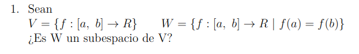
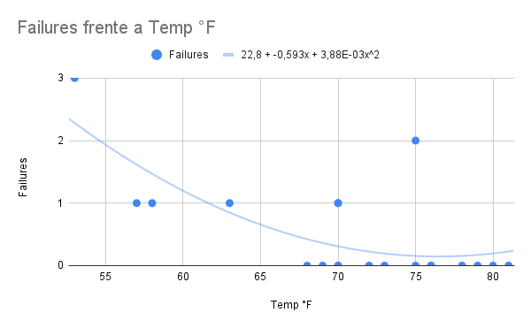

# Taller #2

## Punto #1

Para que $W$ sea un subespacio de $V$ se ha de cumplir con las propiedades:

- El vector cero (0) debe pertenecer al subespacio. Esto implica que el subespacio debe contener al vector nulo.
- El subespacio debe ser cerrado bajo la suma. Esto significa que si tomas dos vectores cualesquiera en el subespacio y los sumas, el resultado debe seguir estando dentro del subespacio.
- El subespacio debe ser cerrado bajo la multiplicación por un escalar. Esto implica que si tomas cualquier vector del subespacio y lo multiplicas por un escalar cualquiera, el resultado debe seguir estando dentro del subespacio

Si un vector cumple estas tres propiedades, entonces se puede afirmar que pertenece al subespacio vectorial. Si no cumple alguna de estas propiedades, entonces no es parte del subespacio.

Por lo que para la primera propiedad podemos afirmar que:

$$
f(a) = f(b) = 0
$$

$$
f(x) = 0 \therefore f \in W
$$

Por lo cual cumple la primera propiedad

Para verificar la segunda propiedad podemos defindir 2 funciones $f$ y $g$ tal que:

$$
f, g \in W \rightarrow R
$$

Con estas funciones podemos determinar 2 puntos $a$ y $b$ para las funciones $f$ y $g$ de modo que:

$$
f(a) = f(b) \rightarrow f(x)
$$

$$
g(a) = g(b) \rightarrow g(x)
$$

Ahora bien, para comprobar la segunda propuedad determinamos un $h$

$$
h(x) = f(x) + g(x)
$$

Por lo que al platear la igualdad

$$
h(a) = h(b)
$$

Si la igualdad se cumple se determina que la propiedad se cumple

$$
[f+g](a) = [f+g](b)
$$

$$
f(a) + g(a) = f(b) + g(b)
$$

$$
\therefore f(a) + g(a) = h(a) ; f(b) + g(b) = h(b) \checkmark
$$

Por tanto cumple la segunda propiedad

Para determinar la tercera propiedad hemos de usar un escalar $\beta$ que debe de poder cumplir que:

$$
\exist \beta \in [a, b] \& f \in W : \beta f(a) = \beta f(b) \rightarrow \beta f(x) \in W
$$

Para plantear si esta propiedad se cumple indicamos:

$$
\beta f (x) = h(x)
$$

Si evaluamos $\beta f (x)$ en $a$ y $b$ podemos determinar que la función de $h$ será simplemente amplificar lo que sea que haga $f$

$$
\beta f (x) \rightarrow h(x) \therefore h(a) = h(b) \lor \beta f (b) = \beta f (b) \checkmark
$$

Por lo tanto podemos afirmar que $W$ cumple las 3 propiedades por tanto $W$ es considerado un subespacio de $V$

## Punto #2

### Punto #2.a

Tomando la ecuación que especifica el problema

$$
ax^{2} + by^{2} + cxy + dx + ey + f = 0
$$

Planteamos puntos sencillos para poder verificar la afirmación anterior, para ellos tomemos puntos entre 1, -1 y 0 (Así será más sencillo de resolver):

A = (1, 1)
B = (1, 0)
C = (0, 1)
D = (-1, 0)
E = (0, -1)

Con esos puntos podemos rapidamente verificar su ubicación en el plano

Con estos la pequeña figura que estos forman

Ahora bien, con estos puntos se ha de plantear un sistema de ecuaciones para poder determinar la afirmación que nos plantea el problema de una manera viable:

$$
A: \space a(1)^{2} + b(1)^{2} + c(1)(1) + d(1) + e(1) + f = 0
$$

$$
B: \space a(1)^{2} + b(0)^{2} + c(1)(0) + d(1) + e(0) + f = 0
$$

$$
C: \space a(0)^{2} + b(1)^{2} + c(0)(1) + d(0) + e(1) + f = 0
$$

$$
D: \space a(-1)^{2} + b(0)^{2} + c(-1)(0) + d(-1) + e(0) + f = 0
$$

$$
E: \space a(0)^{2} + b(-1)^{2} + c(0)(-1) + d(0) + e(-1) + f = 0
$$

Si efectuamos algunos de los calculos podemos simplificar un poco las ecuaciones para los puntos dados:

$$
A: \space a(1)^{2} + b(1)^{2} + c(1)(1) + d(1) + e(1) + f = 0
$$

$$
B: \space a(1)^{2} + \cancel{b(0)^{2}} + \cancel{c(1)(0)} + d(1) + \cancel{e(0)} + f = 0
$$

$$
C: \space \cancel{a(0)^{2}} + b(1)^{2} + \cancel{c(0)(1)} + \cancel{d(0)} + e(1) + f = 0
$$

$$
D: \space a(-1)^{2} + \cancel{b(0)^{2}} + \cancel{c(-1)(0)} + d(-1) + \cancel{e(0)} + f = 0
$$

$$
E: \space \cancel{a(0)^{2}} + b(-1)^{2} + \cancel{c(0)(-1)} + \cancel{d(0)} + e(-1) + f = 0
$$

Efectuando las multiplicaciones

$$
A: \space a + b + c + d + e + f = 0
$$

$$
B: \space a + d + f = 0
$$

$$
C: \space b + e + f = 0
$$

$$
D: \space a - d + f = 0
$$

$$
E: \space b - e + f = 0
$$

Ya con esta simplificación podemos pasar a la una representación de sistema de ecuaciones

$$
\left \{
    \begin{array}{rrrrrrrrrrrrr}
        a & + & b & + & c & + & d & + & e & + & f & = & 0 \\
        a &  &  &  &  & + & d &  &  & + & f & = & 0 \\
        &  & b &  &  &  &  & + & e & + & f & = & 0 \\
        a &  &  &  &  & - & d &  &  & + & f & = & 0 \\
        &  & b &  &  &  &  & - & e & + & f & = & 0
    \end{array}
\right .
$$

Este sistema lo podemos resolver usando matrices, para ello la presentación correspondiente sería:

$$
\begin{pmatrix}
    1 &  1 &  1 &  1 &  1 &  1 \\
    1 &  0 &  0 &  1 &  0 &  1 \\
    0 &  1 &  0 &  0 &  1 &  1 \\
    1 &  0 &  0 & -1 &  0 &  1 \\
    0 &  1 &  0 &  0 & -1 &  1
\end{pmatrix}
$$

Para resolver esto podemos llevar la matriz a REF usando eliminación Gaussiana

$F2 - F4; F3 - F5$

$$
\begin{pmatrix}
    1 &  1 &  1 &  1 &  1 &  1 \\
    0 &  0 &  0 &  2 &  1 &  0 \\
    0 &  0 &  0 &  0 &  2 &  0 \\
    1 &  0 &  0 & -1 &  0 &  1 \\
    0 &  1 &  0 &  0 & -1 &  1
\end{pmatrix}
$$

$F4 - F1$

$$
\begin{pmatrix}
    1 &  1 &  1 &  1 &  1 &  1 \\
    0 &  0 &  0 &  2 &  1 &  0 \\
    0 &  0 &  0 &  0 &  2 &  0 \\
    0 & -1 & -1 & -2 & -1 &  0 \\
    0 &  1 &  0 &  0 & -1 &  1
\end{pmatrix}
$$

$F2 + F4; F3 + 2 * F5$

$$
\begin{pmatrix}
    1 &  1 &  1 &  1 &  1 &  1 \\
    0 & -1 & -1 &  0 &  0 &  0 \\
    0 &  2 &  0 &  0 &  0 &  2 \\
    0 & -1 & -1 & -2 & -1 &  0 \\
    0 &  1 &  0 &  0 & -1 &  1
\end{pmatrix}
$$

$F3 + 2 * F2; F4 - F2; F5 + F2$

$$
\begin{pmatrix}
    1 &  1 &  1 &  1 &  1 &  1 \\
    0 & -1 & -1 &  0 &  0 &  0 \\
    0 &  0 & -2 &  0 &  0 &  2 \\
    0 &  0 &  0 & -2 & -1 &  0 \\
    0 &  0 & -1 &  0 & -1 &  1
\end{pmatrix}
$$

$F3 * \frac{1}{2}; F5 - F3$

$$
\begin{pmatrix}
    1 &  1 &  1 &  1 &  1 &  1 \\
    0 & -1 & -1 &  0 &  0 &  0 \\
    0 &  0 & -1 &  0 &  0 &  1 \\
    0 &  0 &  0 & -2 & -1 &  0 \\
    0 &  0 &  0 &  0 & -1 &  1
\end{pmatrix}
$$

De la última matriz se puede obtener el siguiente sistema de ecuaciones

$$
\left \{
    \begin{array}{rrrrrrrrrrrrr}
        a & + & b & + & c & + & d & + & e & + & f & = & 0 \\
        & - & b & - & c &  &  &  &  &  &  & = & 0 \\
        &  &  & - & c &  &  &  &  & + & f & = & 0 \\
        &  &  &  &  & - & 2d & - & e &  &  & = & 0 \\
        &  &  &  &  &  &  & - & e &  &  & = & 0
    \end{array}
\right .
$$

Efectuando algunos calculos llegamos a

$$
\left \{
    \begin{array}{rrrrrrrrrrrrr}
        a & = & -f \\
        b & = & f \\
        c & = & - f \\
        d & = & 0 \\
        e & = & 0
    \end{array}
\right .
$$

Con lo que podemos determinar que el vector general resultante será:

$$
\vec{v}_{result} = \begin{pmatrix}
    -f \\
    f  \\
    -f \\
    0  \\
    0  \\
    f
\end{pmatrix}
$$

### Punto #2.b

Primero se analiza un poco el sistema de ecuaciones

$$
\left \{
    \begin{array}{rrrrrrrrrrrrr}
        3x_{1} & - & 2x_{2} & + & 5x_{3} & = & a \\
        2x_{1} & + &  x_{2} & + & 3x_{3} & = & b \\
        x_{1}  & + & 4x_{3} & + &  x_{3} & = & c
    \end{array}
\right .
$$

Tal como se presenta el problema se puede simplificar un poco

$$
\left \{
    \begin{array}{rrrrrrrrrrrrr}
        3x_{1} & - & 2x_{2} & + & 5x_{3} & = & a \\
        2x_{1} & + &  x_{2} & + & 3x_{3} & = & b \\
        x_{1}  & + & 0x_{2} & + & 5x_{3} & = & c
    \end{array}
\right .
$$

Ahora bien, se puede usar una matriz y una solución por Gauss Jordan para responder la incognita que plantea el problema

$$
\begin{pmatrix}
    3 & -2 &  5 & \vdots & a \\
    2 &  1 &  3 & \vdots & b \\
    1 &  0 &  5 & \vdots & c
\end{pmatrix}
$$

$F1 - F2$

$$
\begin{pmatrix}
    1 & -3 &  2 & \vdots & a - b \\
    2 &  1 &  3 & \vdots & b \\
    1 &  0 &  5 & \vdots & c
\end{pmatrix}
$$

$F2 - 2 F1; F3 - F1$

$$
\begin{pmatrix}
    1 & -3 &  2 & \vdots & a - b \\
    0 & -5 & -1 & \vdots & -2a + 3b \\
    0 &  7 & -1 & \vdots & c - a + b
\end{pmatrix}
$$

$F2 + F3; F1 + 2 F3$

$$
\begin{pmatrix}
    1 & 11 &  0 & \vdots & -a + b + 2c \\
    0 &  2 & -2 & \vdots & -3a + 4b + c \\
    0 &  7 & -1 & \vdots & c - a + b
\end{pmatrix}
$$

$F2 - 2 F3$

$$
\begin{pmatrix}
    1 & 11 &  0 & \vdots & -a + b + 2c \\
    0 &-12 &  0 & \vdots & -a + 2b - c \\
    0 &  7 & -1 & \vdots & c - a + b
\end{pmatrix}
$$

$F2 * - \frac{1}{12}$

$$
\begin{pmatrix}
    1 & 11 &  0 & \vdots & -a + b + 2c \\
    0 &  1 &  0 & \vdots & \frac{a}{12} - \frac{b}{6} + \frac{c}{12} \\
    0 &  7 & -1 & \vdots & c - a + b
\end{pmatrix}
$$

$F1 - 11 F2; F3 - 7 F2$

$$
\begin{pmatrix}
    1 &  0 &  0 & \vdots & - \frac{a}{12} + \frac{17b}{6} + \frac{13c}{12} \\
    0 &  1 &  0 & \vdots & \frac{a}{12} - \frac{b}{6} + \frac{c}{12} \\
    0 &  0 & -1 & \vdots & - \frac{19a}{12} - \frac{b}{6} + \frac{31c}{12}
\end{pmatrix}
$$

$F3 * (-1)$

$$
\begin{pmatrix}
    1 &  0 &  0 & \vdots & -\frac{a}{12} + \frac{17b}{6} + \frac{13c}{12} \\
    0 &  1 &  0 & \vdots & \frac{a}{12} - \frac{b}{6} + \frac{c}{12} \\
    0 &  0 &  1 & \vdots & \frac{19a}{12} + \frac{b}{6} - \frac{31c}{12}
\end{pmatrix}
$$

Por lo que la solución general será:

$$
\vec{v}_{result} = \begin{pmatrix}
 \frac{-a + 13c + 34b}{12} \\
 \frac{a + c - 2b}{12} \\
 \frac{19a - 31c + 2b}{12}
\end{pmatrix}
$$

## Punto #3

### Punto #3.a

Con los datos podemos hacer un regresión lineal simple para analizar los datos

Sin embargo, esta regresión no dice mucho, por lo que usando se podría usar una regresión polinómica de grado 2 para hacer un mejor match con los datos

Ya con esta gráfica podemos decir que los fallos se incrementaban bastante cuando la temperatura era muy baja, mientras que se estabilizaban al rededor de los $55°$ y los $75°$ de igual forma se puede usar la función que describe la función para dar un valor más exacto, para ellos usamos:

$$
(-0,0692)(31) + 5,39 = 3,2448
$$

Esto indica según la regresión lineal simple que los fallos en $31°$ grados será de $3$ es decir, más o menos $2$ fallos. Sin embargo, podemos usar la regresión polinómica para un mejor predicción.

$$
22,8 - 0,593x + 3,88x^2 = 3733,097
$$

Dando una predicción de 18 fallos, lo cual es un mejor match (Recordemos que el cohete explotó)

### Punto #3.b

A partir de los $136°$ los fallos llegan a más $4$ o bien, cuando la temperatura es menor o igual a $20°$ los fallos tambien llegan a 4, por ende y según la regresión lineal simple, los fallos llegan a 4 en el intervalo de:

$$
20 \leq x \geq 136
$$

## Punto #4

### Punto #4.i

$$
det \begin{pmatrix}
    1   &     1 &   1 \\
    a   &     b &   b \\
    a^2 &   b^2 & c^2
\end{pmatrix} = (b - a)(c - a)(c - b)
$$

El determinante de la matriz vendrá dado por el calculo de:

$$
(b - a)(c^2 - a^2) - (c - a)(b^2 - a^2) = (b - a)(c - a)(c - b)
$$

$$
(b - a)(c - a)(c + a) - (c - a)(b - a)(b + a) = (b - a)(c - a)(c - b)
$$

$$
(b - a)[(c - a)(c + a) - (c - a)(b + a)] = (b - a)(c - a)(c - b)
$$

$$
(b - a)[(c - a)[(c + a) - (b + a)]] = (b - a)(c - a)(c - b)
$$

$$
(b - a)[(c - a)[(c + a - b - a)]] = (b - a)(c - a)(c - b)
$$

$$
(b - a)[(c - a)[(c + \cancel{a} - b \cancel{- a})]] = (b - a)(c - a)(c - b)
$$

$$
(b - a)[(c - a)[(c - b)]] = (b - a)(c - a)(c - b)
$$

Eliminando algunos paréntesis

$$
(b - a)(c - a)(c - b) = (b - a)(c - a)(c - b) \checkmark
$$

### Punto #4.ii

Para determinar el determinante de esta matriz que es $4x4$

$$
det \begin{pmatrix}
    0      &  1 &  a & a^{2} \\
    -1     &  0 &  1 & a \\
    -a     & -1 &  0 & 1 \\
    -a^{2} & -a & -1 & 0
\end{pmatrix}
$$

Podemos usar el método de Laplace $|A| = \sum_{i=1}^{n}{a_{ij}(-1^{i+j})|A_{ij}|}$ de modo que $det(A) = a_{11} * det(A_{11}) - a_{12} * det(A_{12}) + a_{13} * det(A_{13}) - a_{14} * det(A_{14})$ donde:

- $a_{11} = 0$
- $a_{12} = 1$
- $a_{13} = a$
- $a_{14} = a^2$

Por lo expandiendo las expresiones anteriores:

$$
0 * \det \begin{pmatrix}
    0  &  1 & a \\
    -1 &  0 & 1 \\
    -a & -1 & 0
\end{pmatrix}
$$

$$
1 * \det \begin{pmatrix}
    -1   &  1 & a \\
    -a   &  0 & 1 \\
    -a^2 & -1 & 0
\end{pmatrix}
$$

$$
a * \det \begin{pmatrix}
    -1   &  0 &  a \\
    -a   & -1 &  1 \\
    -a^2 & -a &  0
\end{pmatrix}
$$

$$
a^2 * \det \begin{pmatrix}
    -1   &  0 &  1 \\
    -1   & -1 &  0 \\
    -a^2 & -a & -1
\end{pmatrix}
$$

Este calculo se puede simplificar un poco puesto que el primer determinante está siendo multiplicado por 0:

$$
\cancel{
    0 * \det \begin{pmatrix}
        0  &  1 & a \\
        -1 &  0 & 1 \\
        -a & -1 & 0
    \end{pmatrix}
} \space - 1 * \det \begin{pmatrix}
    -1   &  1 & a \\
    -a   &  0 & 1 \\
    -a^2 & -1 & 0
\end{pmatrix} \space + a * \det \begin{pmatrix}
    -1   &  0 &  a \\
    -a   & -1 &  1 \\
    -a^2 & -a &  0
\end{pmatrix} \space - a^2 * \det \begin{pmatrix}
    -1   &  0 &  1 \\
    -a   & -1 &  0 \\
    -a^2 & -a & -1
\end{pmatrix}
$$

Para determinar el determinante de las 3 matrices de dimensión $3x3$ se puede usar el método de Laplace $det(A) = a_{11} * det(A_{11}) - a_{12} * det(A_{12}) + a_{13} * det(A_{13})$ donde:

$$
\det \begin{pmatrix}
    -1   &  1 & a \\
    -a   &  0 & 1 \\
    -a^2 & -1 & 0
\end{pmatrix} = (-1) \det \begin{pmatrix}
    0  & 1 \\
    -1 & 0
\end{pmatrix} - 1 * \det \begin{pmatrix}
    -a   & 1 \\
    -a^2 & 0
\end{pmatrix} + a * \det \begin{pmatrix}
    -a   & 0 \\
    -a^2 & -1
\end{pmatrix}
$$

$$
(-1) * 1 - 1 * a^2 + a * a
$$

$$
-1 - a^2 + a^2
$$

$$
-1
$$

$$
\det \begin{pmatrix}
    -1   &  0 &  a \\
    -a   & -1 &  1 \\
    -a^2 & -a &  0
\end{pmatrix} = (-1) \det \begin{pmatrix}
    -1 & 1 \\
    -a & 0
\end{pmatrix} - 0 * \det \begin{pmatrix}
    -a   & 1 \\
    -a^2 & 0
\end{pmatrix} + a * \det \begin{pmatrix}
    -a   & -1 \\
    -a^2 & -a
\end{pmatrix}
$$

$$
(-1) \det \begin{pmatrix}
    -1 & 1 \\
    -a & 0
\end{pmatrix}
\cancel{
    - 0 * \det \begin{pmatrix}
        -a   & 1 \\
        -a^2 & 0
    \end{pmatrix}
} + a * \det \begin{pmatrix}
    -a   & -1 \\
    -a^2 & -a
\end{pmatrix}
$$

$$
(-1) \det \begin{pmatrix}
    -1 & 1 \\
    -a & 0
\end{pmatrix} + a * \det \begin{pmatrix}
    -a   & -1 \\
    -a^2 & -a
\end{pmatrix}
$$

$$
(-1) a - 0 * a^2 + a * 0
$$

$$
-a
$$

$$
\det \begin{pmatrix}
    -1   &  0 &  1 \\
    -a   & -1 &  0 \\
    -a^2 & -a & -1
\end{pmatrix} = (-1) \det \begin{pmatrix}
    -1 &  0 \\
    -a & -1
\end{pmatrix} - 0 * \det \begin{pmatrix}
    -a   &  0 \\
    -a^2 & -1
\end{pmatrix} + 1 * \det \begin{pmatrix}
    -a   & -1 \\
    -a^2 & -a
\end{pmatrix}
$$

$$
(-1) \det \begin{pmatrix}
    -1 &  0 \\
    -a & -1
\end{pmatrix}
\cancel{
    - 0 * \det \begin{pmatrix}
        -a   &  0 \\
        -a^2 & -1
    \end{pmatrix}
} + 1 * \det \begin{pmatrix}
    -a   & -1 \\
    -a^2 & -a
\end{pmatrix}
$$

$$
(-1) \det \begin{pmatrix}
    -1 &  0 \\
    -a & -1
\end{pmatrix} + 1 * \det \begin{pmatrix}
    -a   & -1 \\
    -a^2 & -a
\end{pmatrix}
$$

$$
(-1) * 1 - 0 * a + 1 * 0
$$

$$
-1
$$

Reemplazando todas los determinantes

$$
-1 * \det \begin{pmatrix}
    -1   &  1 & a \\
    -a   &  0 & 1 \\
    -a^2 & -1 & 0
\end{pmatrix} \space + a * \det \begin{pmatrix}
    -1   &  0 &  a \\
    -a   & -1 &  1 \\
    -a^2 & -a &  0
\end{pmatrix} \space - a^2 * \det \begin{pmatrix}
    -1   &  0 &  1 \\
    -a   & -1 &  0 \\
    -a^2 & -a & -1
\end{pmatrix}
$$

$$
-1 * (-1) + a * (-a) - a^2 (-1)
$$

$$
1 - a^2 + a^2
$$

$$
1 \cancel{- a^2 + a^2}
$$

$$
1
$$

Por tanto el determinante de la matriz será 1

$$
det \begin{pmatrix}
    0      &  1 &  a & a^{2} \\
    -1     &  0 &  1 & a \\
    -a     & -1 &  0 & 1 \\
    -a^{2} & -a & -1 & 0
\end{pmatrix} = 1 \checkmark
$$

### Punto #4.iii

Una matriz se considera singular cuando no tiene inversa, es decir, cuando no existe una matriz que al multiplicarse por la matriz original resulte en la identidad. Esto implica que la matriz no tiene una columna linealmente independiente o que su determinante es igual a cero.

$$
A = \begin{pmatrix}
    1   &     1 &   2t - 1 \\
    t   &     1 &        1 \\
    1   &     t &        1
\end{pmatrix}
$$

Por tanto si $det(A) \neq 0$ entonces la matriz no será es singular. Dicho lo anterior:

$$
det(A) = 0 ?
$$

$$
det \begin{pmatrix}
    1   &     1 &   2t - 1 \\
    t   &     1 &        1 \\
    1   &     t &        1
\end{pmatrix}
$$

Para calcular el determinante de una matriz 3x3 podemos usar el método de Laplace $det(A) = a_{11} * det(A_{11}) - a_{12} * det(A_{12}) + a_{13} * det(A_{13})$ donde:

- $a_{11} = 1$
- $a_{12} = 1$
- $a_{13} = 2t - 1$

Por lo que la expresión de los determinantes será:

$a_{11} * det(A_{11})$

$$
1 * \det \begin{pmatrix}
    1 & 1 \\
    t & 1
\end{pmatrix} = 1 * (1 - t)
$$

$a_{12} * det(A_{12})$

$$
1 * \det \begin{pmatrix}
    t & 1 \\
    1 & 1
\end{pmatrix} = - 1 * (t - 1)
$$

$a_{13} * det(A_{13})$

$$
(2t - 1) * \det \begin{pmatrix}
    t & 1 \\
    1 & t
\end{pmatrix} = (2t - 1)(t^2 - 1)
$$

Por tanto $det(A)$ será igual a:

$$
det(A) = 1 * (1 - t) - 1 * (t - 1) + (2t - 1)(t^2 - 1)
$$

Simplificando:

$$
(1 - t) + (1 - t) + (2t - 1)(t^2 - 1)
$$

Si vemos rápidamente el grafíco que genera este polinomio nos hacemos una idea de las raices:

Factorizando:

$$
(t-1)^2(2t + 3)
$$

Por lo que las raíces del polinomio serán:

- $t = 1$
- $t = - \frac{3}{2}$

Por tanto para que la matriz A no sea singular $t$ debe ser diferente de $1$ y $- \frac{3}{2}$

$$
t \in R - {1, - \frac{3}{2}} \checkmark
$$

## Punto #5

### Punto #5.i

La ecuación matricial $A^2 = I$, donde $A$ es una matriz cuadrada $2x2$ e $I$ es la matriz identidad $2x2$, puede tener diferentes soluciones en función de la matriz $A$.

En general, hay tres posibles soluciones para la ecuación matricial $A^2 = I$:

- Solución única: Si $A$ es una matriz de la forma $A = \pm I$, es decir, $A$ es igual a la matriz identidad o su negativa, entonces la ecuación se cumple y hay una única solución.

- Infinitas soluciones: Si $A$ es una matriz de la forma $A = \pm R$, donde $R$ es una matriz de rotación $2x2$, entonces la ecuación se cumple y hay infinitas soluciones. Esto se debe a que las matrices de rotación satisfacen la propiedad $R^2 = I$.

- Sin solución: Para cualquier otra matriz $A$ que no sea la identidad, su negativa o una matriz de rotación, la ecuación $A^2 = I$ no tiene solución.

Por lo tanto, en general, la ecuación matricial $A^2 = I$ en matrices cuadradas $2x2$ puede tener una solución única, infinitas soluciones o ninguna solución, dependiendo de la matriz $A$ específica.

### Punto #5.ii

$$
A = \begin{pmatrix}
    1 & -1 \\
    2 &  0
\end{pmatrix}
$$

$$
X = \begin{pmatrix}
    X & Y \\
    Z & W
\end{pmatrix}
$$

$$
AX - XA = I
$$

Para determinar si $AX - XA$ cumple con la matriz identidad $I$, se ha de efectuar el calculo

$$
AX=\begin{pmatrix}
    1 & -1 \\
    2 &  0
\end{pmatrix} \begin{pmatrix}
    X & Y \\
    Z & W
\end{pmatrix} = \begin{pmatrix}
    X-Z & Y-W \\
    2X  & 2Y
\end{pmatrix}
$$

$$
AX=\begin{pmatrix}
    X & Y \\
    Z & W
\end{pmatrix}
\begin{pmatrix}
    1 & -1 \\
    2 &  0
\end{pmatrix} = \begin{pmatrix}
    X+2Y & -X \\
    Z+2W & -Z
\end{pmatrix}
$$

$$
AX - XA = \begin{pmatrix}
    X-Z & Y-W \\
    2X  & 2Y
\end{pmatrix} - \begin{pmatrix}
    X+2Y & -X \\
    Z+2W & -Z
\end{pmatrix}
$$

$$
\begin{pmatrix}
    (X-Z) - (X+2Y) & (Y-W) - (-X) \\
    2X - (Z+2W)    & 2Y - (-Z)
\end{pmatrix}
$$

$$
\begin{pmatrix}
    -Z-2Y   & Y-W+X \\
    2X-Z-2W & 2Y+Z
\end{pmatrix}
$$

Esta matriz se puede convertir en un sistema de ecuaciones para poder verificar la ecuación usando una matriz aumentada, por lo que el primer paso será verificar el sistema de ecuaciones

$$
\left \{
    \begin{array}{rrrrrrrrrrrrr}
        & - & 2Y & - & Z & & & = & 1 \\
        X & + & Y & & & - & W & = & 0 \\
        2x & &  & - & Z & - & 2W & = & 0 \\
        & & 2Y & + & Z & & & = & 1
    \end{array}
\right .
$$

Ya desde el sistema de ecuaciones podemos ver una particularidad que indica este sistema es inconsistente y por ende no tiene solución, la ecuaciones serían:

$$
\left \{
    \begin{array}{rrrrrrrrrrrrr}
        & - & 2Y & - & Z & & & = & 1 \\
        & & 2Y & + & Z & & & = & 1
    \end{array}
\right .
$$

### Punto #5.iii

Para determinar $B^{100}$ se puede aprovechar la estructura triangular, esto indica que elevando la diagonal a la potencia $n$ entonces el valor de ese calculo será equivalente a la matriz a ese valor, por tanto:

$$
B = \begin{pmatrix}
    a   & a - b   & a - b \\
    0   & b       & b - c \\
    0   & 0       & c
\end{pmatrix} \rightarrow 
\begin{pmatrix}
    a^{100} & a - b   & a - b \\
    0       & b^{100} & b - c \\
    0       & 0       & c^{100}
\end{pmatrix}
$$

$$
\therefore B^{100} = \begin{pmatrix}
    a^{100} & a - b   & a - b \\
    0       & b^{100} & b - c \\
    0       & 0       & c^{100}
\end{pmatrix} \checkmark
$$